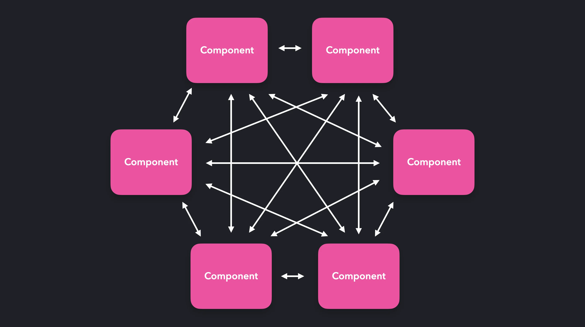
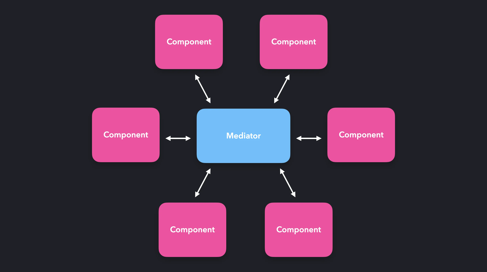

# Посередник / Mediator

**Посередник** — це поведінковий патерн проектування, що дає змогу зменшити зв’язаність великої кількості класів між собою, завдяки переміщенню цих зв’язків до одного класу-посередника.

## Проблема 😔
У складних додатках, де багато компонентів взаємодіють один з одним, прямий зв'язок між компонентами може призвести до великої залежності та жорсткої взаємозв'язаності. Це ускладнює модифікацію, тестування та розширення системи, оскільки зміни в одному компоненті можуть вимагати каскадних змін у багатьох інших компонентах.


## Рішення 🥳
Патерн "Mediator" вводить посередника — центральний компонент, який бере на себе управління взаємодіями між різними компонентами. Замість того, щоб компоненти спілкувалися напряму один з одним, вони спілкуються через медіатора. Це зменшує залежності між окремими компонентами, оскільки вони більше не потребують знань про імплементацію чи існування інших компонентів. Такий підхід спрощує модифікацію та розширення системи, оскільки зміни в одному компоненті не впливають безпосередньо на інші компоненти.


## Життєвий приклад 👰‍🤵
Весільний координатор діє як медіатор між різними постачальниками послуг, які взаємодіють під час підготовки та проведення весільного заходу. Ці постачальники включають флористів, кейтеринг, фотографів, музикантів та орендодавців місця проведення.

Проблема без медіатора:
Якщо брати участь у весільному заході без координатора, кожен постачальник послуг міг би мати непрямі або некоординовані зв'язки з іншими постачальниками. Це могло б створити плутанину і проблеми з таймінгом, дублікацією зусиль чи протиріччями у планах.

Рішення з використанням медіатора:
Весільний координатор (медіатор) централізовано управляє всіма взаємодіями між постачальниками послуг. Він знає розклад та вимоги молодят, тому може ефективно координувати час та ресурси кожного постачальника, гарантуючи, що всі елементи весілля гармонійно взаємодіють.

Як це працює:

- Флористи повідомляють координатору про час доставки та встановлення квіткових композицій.
- Кейтеринг отримує вказівки щодо часу прибуття та підготовки страв від координатора, згідно з графіком заходу.
- Фотографи координують з координатором моменти для зйомки, щоб уникнути збігу з моментами подачі їжі або виступами.
- Музиканти отримують інформацію про час виступу та особливі побажання молодят від координатора, що дозволяє їм підготуватися та виступити вчасно.
- Орендодавці місця проведення узгоджують з координатором деталі прибуття та вибуття інших постачальників послуг, щоб все було організовано та чисто.


## Так не робити 🙅
```jsx
import { useState } from 'react';

function App() {
    return (
        <div>
            <UserInput />
        </div>
    );
}

function UserInput() {
    const [input, setInput] = useState('');
    const [message, setMessage] = useState("");

    const handleInputChange = (e) => {
        setInput(e.target.value);
    };

    const handleSend = () => {
        setMessage(input);
        setInput('');
    };

    return (
        <>
          <div>
            <input type="text" value={input} onChange={handleInputChange} />
            <button onClick={handleSend}>Send</button>
          </div>
          <MessageDisplay message={message} />
        </>
    );
}

// Компонент для відображення повідомлень
function MessageDisplay({ message }) {
    return <p>Message: {message}</p>;
}

export default ChatMediator;
```


## А так вже треба 🧐
```jsx
import { useState } from 'react';

// Компонент Медіатор, який контролює логіку взаємодій між двома іншими компонентами
function ChatMediator() {
    const [message, setMessage] = useState("");

    const handleMessage = (text) => {
        setMessage(text);
    };

    return (
        <div>
            <UserInput onSend={handleMessage} />
            <MessageDisplay message={message} />
        </div>
    );
}

// Компонент для вводу тексту
function UserInput({ onSend }) {
    const [input, setInput] = useState('');

    const handleInputChange = (e) => {
        setInput(e.target.value);
    };

    const handleSend = () => {
        onSend(input);
        setInput('');
    };

    return (
        <div>
            <input type="text" value={input} onChange={handleInputChange} />
            <button onClick={handleSend}>Send</button>
        </div>
    );
}

// Компонент для відображення повідомлень
function MessageDisplay({ message }) {
    return <p>Message: {message}</p>;
}

export default ChatMediator;
```

## Взаємодія з патерном Спостерігач 🥸

```jsx
import { useState, useEffect } from 'react';

// Медіатор, який управляє підпискою та розсилкою повідомлень
function useMediator() {
    const [observers, setObservers] = useState([]);

    // Підписатись на повідомлення
    const subscribe = (callback) => {
        setObservers(prev => [...prev, callback]);
    };

    // Відправити повідомлення всім підписникам
    const publish = (message) => {
        observers.forEach(callback => callback(message));
    };

    return { subscribe, publish };
}

// Компонент кнопки для відправки повідомлень
function ButtonComponent({ mediator }) {
    const sendMessage = () => {
        mediator.publish("Hello from the Button!");
    };

    return (
        <button onClick={sendMessage}>Send Message</button>
    );
}

// Компонент для відображення отриманих повідомлень
function DisplayComponent({ mediator }) {
    const [message, setMessage] = useState('Waiting for message...');

    useEffect(() => {
        mediator.subscribe(setMessage);
    }, [mediator]);

    return <div>Message: {message}</div>;
}

// Головний компонент, що ініціює медіатор
function MediatorApp() {
    const mediator = useMediator();

    return (
        <div>
            <ButtonComponent mediator={mediator} />
            <DisplayComponent mediator={mediator} />
        </div>
    );
}

export default MediatorApp;
```

## Коли використовувати 🤔
- Коли вам складно змінювати деякі класи через те, що вони мають величезну кількість хаотичних зв’язків з іншими класами.
- Посередник дозволяє розмістити усі ці зв’язки в одному класі. Після цього вам буде легше їх відрефакторити, зроби- ти більш зрозумілими й гнучкими.
- Коли ви не можете повторно використовувати клас, оскільки він залежить від безлічі інших класів.
- Після застосування патерна компоненти втрачають колишні зв’язки з іншими компонентами, а все їхнє спілкування від- бувається опосередковано, через об’єкт посередника.
- Коли вам доводиться створювати багато підкласів компо- нентів, щоб використовувати одні й ті самі компоненти в різних контекстах.
- Якщо раніше зміна відносин в одному компоненті могла призвести до лавини змін в усіх інших компонентах, то тепер вам достатньо створити підклас посередника та змі- нити в ньому зв’язки між компонентами.

### Pros 😎

✅ Усуває залежності між компонентами, дозволяючи викори-
стовувати їх повторно.

✅ Спрощує взаємодію між компонентами.

✅ Централізує керування в одному місці.

### Cons 🫣

❌ Посередник може сильно «роздутися».
